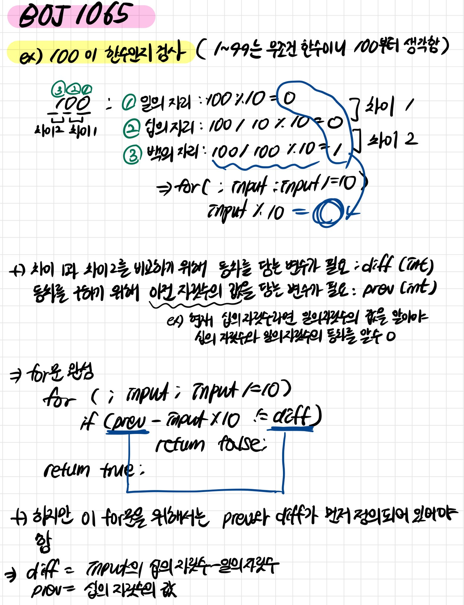

# [BOJ] 1065번 한수 (CPP)

백준온라인저지(BOJ) https://www.acmicpc.net/problem/1065

아이디: song98987

## 1. 문제 설명

| 시간 제한 | 메모리 제한 | 제출  | 정답  | 맞은 사람 | 정답 비율 |
| :-------- | :---------- | :---- | :---- | :-------- | :-------- |
| 2 초      | 128 MB      | 43749 | 21294 | 18338     | 49.226%   |

## 문제

어떤 양의 정수 X의 각 자리가 등차수열을 이룬다면, 그 수를 한수라고 한다. 등차수열은 연속된 두 개의 수의 차이가 일정한 수열을 말한다. N이 주어졌을 때, 1보다 크거나 같고, N보다 작거나 같은 한수의 개수를 출력하는 프로그램을 작성하시오. 

#### 입력

첫째 줄에 1,000보다 작거나 같은 자연수 N이 주어진다.

#### 출력

첫째 줄에 1보다 크거나 같고, N보다 작거나 같은 한수의 개수를 출력한다.


#### 예제 입력 1 

```
110
```

#### 예제 출력 1 

```
99
```

#### 예제 입력 2 

```
1
```

#### 예제 출력 2 

```
1
```

#### 예제 입력 3 

```
210
```

#### 예제 출력 3 

```
105
```

#### 예제 입력 4 

```
1000
```

#### 예제 출력 4 

```
144
```


#### 출처

- 문제를 번역한 사람: [baekjoon](https://www.acmicpc.net/user/baekjoon)
- 어색한 표현을 찾은 사람: [bdh3313](https://www.acmicpc.net/user/bdh3313)
- 잘못된 데이터를 찾은 사람: [djm03178](https://www.acmicpc.net/user/djm03178)
- 데이터를 추가한 사람: [jh05013](https://www.acmicpc.net/user/jh05013)

#### 알고리즘 분류

- [브루트 포스](https://www.acmicpc.net/problem/tag/브루트 포스)
- [탐색](https://www.acmicpc.net/problem/tag/탐색)


## 2. 내 소스 코드

```c++
// github.com/SimDaSong
#define _CRT_SECURE_NO_WARNINGS
#include <iostream>

bool isHansu(int input) {
	int diff; // 등차
	int prev; // 이전 자릿수의 값

	diff = input % 10 - input / 10 % 10; // input의 십의 자릿수 - 일의 자릿수
	prev = input / 10 % 10; // 이전 자릿수의 값

	for (input /= 100; input; input /= 10) {
		if (prev - input % 10 != diff) {
			return false;
		}
	}

	return true;
}

int main() {
	int n; // 입력 값
	int cnt = 0;// 등차의 수

	scanf("%d", &n);

	for (int i = 1; i <= n; i++) {
		if (isHansu(i)) {
			cnt++;
		}
	}

	printf("%d", cnt);
}
```




## 3. 개선점

- 입력값이 1000까지고 1000은 한수일리 없으니 for문 안돌리고 백, 십, 일의 자릿수를 바로 비교해도 됐음
